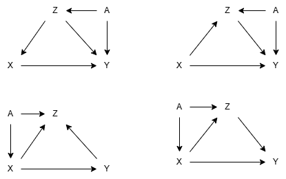

```{r setup, include=FALSE}
knitr::opts_chunk$set(echo = TRUE)
```

# Aufgabe 1: DAG und kausaler Effekt (Aus: „Statistical Rethinking“)

Das Analysieren von DAGs will gelernt sein. Geben Sie für jedes der vier unten aufgeführten DAGs an, welche Variablen Sie gegebenenfalls berücksichtigen (als Bedingung einbeziehen) müssen, um den gesamten kausalen Einfluss von X auf Y zu schätzen.

{width=600px}

> **Erinnerung: Die drei Grundmuster**
>
> - **Fork** (Z → X und Z → Y): Z ist gemeinsame Ursache → adjustieren auf Z, um Backdoor zu schließen
> 
> - **Pipe/Mediator** (X → Z → Y): Z liegt auf dem kausalen Pfad → nicht adjustieren (außer wir wollen direkten Effekt)
> 
> - **Collider** (X → Z ← Y): Z ist Kollider → nicht adjustieren (öffnet sonst eine falsche Verbindung)

> **Erinnerung: Kausale Effekte**
>
> - **Totaler kausaler Effekt**: Alle Pfade von X zu Y (direkte und indirekte) werden berücksichtigt.
> - **Direkter kausaler Effekt**: Nur der direkte Pfad von X zu Y wird berücksichtigt, alle indirekten Pfade werden blockiert.

> **Wie erkenne ich einen kausalen Pfad?**
>
> Ein kausaler Pfad ist ein Pfad von X nach Y, bei dem alle Pfeile in dieselbe Richtung zeigen — nämlich von X weg, Richtung Y. Im Beispiel von DAG 4 (unten rechts) gibt es zwei:
>
> - X → Y (direkt)
> - X → Z → Y (indirekt, über Z)
>
> Der totale kausale Effekt ist die Summe beider Pfade zusammen. Er beantwortet die Frage: "Was passiert mit Y, wenn ich X um 1 erhöhe?" — egal ob der Effekt direkt oder über Zwischenvariablen läuft.


## DAG Analyse

### DAG 1 (oben links)
- direkter kausaler Effekt: X → Y
- indirekter kausaler Effekt: None
- Backdoor-Pfade: X ← Z ← A 
- Totaler kausaler Effekt: X → Y (direkt) + X ← Z ← A (indirekt)

### DAG 2 (oben rechts)
- direkter kausaler Effekt: X → Y
- indirekter kausaler Effekt: X → Z → Y
- Backdoor-Pfade: A → Z → Y
- Totaler kausaler Effekt: X → Y (direkt) + X → Z → Y (indirekt)

### DAG 3 (unten links)
- direkter kausaler Effekt: X → Y
- indirekter kausaler Effekt: None
- Backdoor-Pfade: A → X → Y
- Totaler kausaler Effekt: X → Y (direkt) + A → X → Y (indirekt)

### DAG 4 (unten rechts)
- direkter kausaler Effekt: X → Y
- indirekter kausaler Effekt: X → Z → Y
- Backdoor-Pfade: A → X → Z → Y
- Totaler kausaler Effekt:


## a) Backdoor Path
Welchen Backdoor-Pfad sollte man für den totalen kausalen und den direkten kausalen Effekt schließen?

### DAG 1 (oben links)
- Totaler kausaler Effekt: Backdoor-Pfad X ← Z ← A (durch adjustieren auf Z schließen)
- Direkter kausaler Effekt: Backdoor-Pfad X ← Z ← A (durch adjustieren auf Z schließen)

> **Warum den Pfad A → Y nicht berücksichtigen?**
>
> Der Pfad A → Y beginnt gar nicht bei X — er ist ein direkter Einfluss von A auf Y, aber A ist keine Ursache von X (nur Z ist Ursache von X). Deshalb erzeugt A → Y keine Scheinkorrelation zwischen X und Y.
>
> Anders gesagt: Die Frage ist immer "Gibt es einen nicht-kausalen Weg, über den sich X und Y scheinbar beeinflussen?" — und A → Y alleine schafft das nicht, weil A nicht mit X verbunden ist, sobald wir Z kontrollieren.
>
> Wenn wir auf Z adjustieren, ist X von allem "abgeschnitten" was von oben kommt — egal ob A noch auf Y wirkt oder nicht, das beeinflusst die Schätzung des X→Y Effekts nicht mehr.

### DAG 2 (oben rechts)
- Totaler kausaler Effekt: Backdoor-Pfad X → A → Z → Y (durch adjustieren auf A schließen)
- Direkter kausaler Effekt: Backdoor-Pfad A → Z → Y (durch adjustieren auf Z schließen)

### DAG 3 (unten links)
- Totaler kausaler Effekt: Backdoor-Pfad A → X → Y (durch adjustieren auf A schließen)
- Direkter kausaler Effekt: Backdoor-Pfad A → X → Y (durch adjustieren auf A schließen)

### DAG 4 (unten rechts)
- Totaler kausaler Effekt: Backdoor-Pfad A → X → Z → Y (durch adjustieren auf A schließen)
- Direkter kausaler Effekt: Backdoor-Pfad A → X → Z → Y (durch adjustieren auf A schließen)

## b)
Überprüfen Sie dies mit der Funktion `adjustmentSets` (Paket `dagitty`), nachdem Sie Schritt a) ausgeführt haben. Ein oder zwei Beispiele reichen aus

### DAG 1 (oben links)
```{r}
library(dagitty)

dag1 <- dagitty("dag {
  A -> Z
  A -> Y
  Z -> X
  Z -> Y
  X -> Y
}")

adjustmentSets(dag1, exposure = "X", outcome = "Y", effect = "direct")
adjustmentSets(dag1, exposure = "X", outcome = "Y", effect = "total")
```

### DAG 2 (oben rechts)
```{r}
dag2 <- dagitty("dag {
  A -> Z
  A -> X 
  Z -> Y
  X -> Z
  X -> Y
}")

adjustmentSets(dag2, exposure = "X", outcome = "Y", effect = "direct")
adjustmentSets(dag2, exposure = "X", outcome = "Y", effect = "total")
```

### DAG 3 (unten links)
```{r}
dag3 <- dagitty("dag {
  A -> Z 
  A -> X 
  X -> Y 
  X -> Z 
  Y -> Z
}")

adjustmentSets(dag3, exposure = "X", outcome = "Y", effect = "direct")
adjustmentSets(dag3, exposure = "X", outcome = "Y", effect = "total")
```

### DAG 4 (unten rechts)
```{r}
dag4 <- dagitty("dag {
  A -> Z 
  A -> X 
  X -> Y 
  X -> Z 
  Z -> Y
}")

adjustmentSets(dag4, exposure = "X", outcome = "Y", effect = "direct")
adjustmentSets(dag4, exposure = "X", outcome = "Y", effect = "total")
```

## c)
Führen Sie eine Simulation des DAG oben rechts durch, nehmen Sie an, dass der direkte Kausalkette ein Koeffizient von β = 0,42 zugeordnet ist, und schätzen Sie diesen Wert einmal unter Verwendung des korrekten Anpassungssatzes und einmal ohne Anpassung. Sie können dazu die Funktion `simulateSEM` aus dem Paket `dagitty` verwenden.

```{r}
library(dagitty)

dag2 <- dagitty("dag {
  A -> Z
  A -> X 
  Z -> Y
  X -> Z
  X -> Y
}")

# Adjustment Sets prüfen
adjustmentSets(dag2, exposure = "X", outcome = "Y", effect = "total")
adjustmentSets(dag2, exposure = "X", outcome = "Y", effect = "direct")

# Simulation: X -> Y bekommt β = 0.42, alle anderen Pfade β = 0.5
set.seed(42)
df <- simulateSEM(dag2,
                  b.default = 0.5,
                  b.lower   = 0.42,
                  b.upper   = 0.42,
                  N = 10000)

# 1) OHNE Adjustierung (Backdoor offen -> verzerrt)
model_ohne <- lm(Y ~ X, data = df)
print("Ohne Adjustierung:\n")
print(confint(model_ohne)["X", ])

# 2) Totaler kausaler Effekt: nur auf A adjustieren
model_total <- lm(Y ~ X + A, data = df)
cat("\nTotaler Effekt (Adjustment auf A):\n")
print(confint(model_total)["X", ])

# 3) Direkter kausaler Effekt: auf A und Z adjustieren
model_direkt <- lm(Y ~ X + A + Z, data = df)
cat("\nDirekter Effekt (Adjustment auf A und Z):\n")
print(confint(model_direkt)["X", ])
```